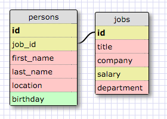
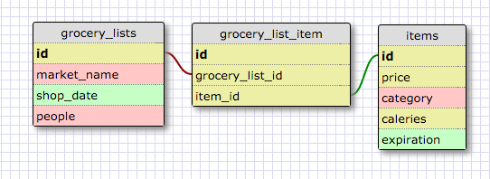

# One to One Schema

 - I went with a persons table and a jobs table. Each person has a job, and the job has information like title, company, location, salary, etc.
 - Separating job into its own entity instead of listing it as an attribute of the person makes sense because there would be a large bulk of attributes that would be empty if the person doesn't have a job.

 # Many to Many Schema

 

# Reflection

 - What is a one-to-one database?
  - A one to one database has two entities in it, each connected.
 - When would you use a one-to-one database? (Think generally, not in terms of the example you created).
  - I would use a one to one database when one attribute in an entity has many dependencies, and if one is empty, then the rest will be empty. In that case, it makes sense to divide it out to a second table.
 - What is a many-to-many database?
  - A many to many database is when there can be many entities, and each one can have many other entities.
 - When would you use a many-to-many database? (Think generally, not in terms of the example you created).
  - You'd use a many to many database when there are a lot of objects that can all be combined each which way, and it doesn't make sense to create a new table each time that happens.

 - What is confusing about database schemas? What makes sense?
   - Something I had to wrap my head around was the idea of a "single grocery list" and what that query might look like. You'd have to return all items in a given grocery list.
